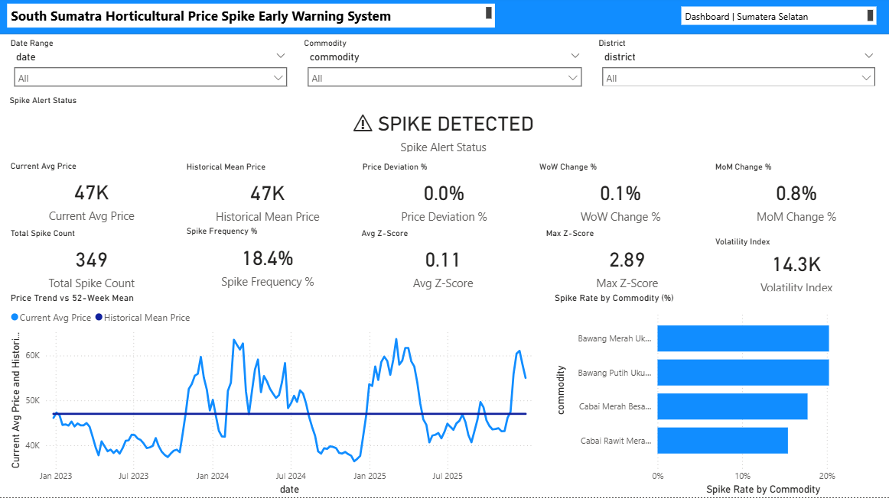

# South Sumatra Horticultural Price Spike Early-Warning System

A satellite-informed early-warning system for horticultural price spikes in South Sumatra, Indonesia. The pipeline integrates PIHPS weekly market prices, MODIS NDVI/EVI vegetation anomalies, CHIRPS rainfall, and OpenStreetMap road-accessibility features to predict price spikes for key commodities using machine learning.

## Key Findings

| Model | AUC | Precision | Recall | F1 |
|---|---|---|---|---|
| Logistic Regression | **0.877** | 0.392 | 0.901 | 0.547 |
| Random Forest | 0.863 | **0.485** | 0.802 | **0.605** |

**Ablation results** — removing price momentum features:

| Condition | LR AUC | RF AUC |
|---|---|---|
| Full model | 0.877 | 0.863 |
| Early-warning only (no price momentum) | 0.762 | 0.680 |
| Bawang satellite-only | 0.767 | 0.735 |
| Cabai satellite-only | — | 0.487 |

**Central finding:** Satellite-derived environmental stress signals have real predictive value for horticultural price spikes, but their effectiveness varies by commodity. Signals are substantially more useful for slower-developing allium (bawang) shocks (AUC 0.767) than for fast-moving chili (cabai) shocks (AUC 0.487).

## Study Area & Data

- **Commodities:** Bawang Merah Ukuran Sedang, Bawang Putih Ukuran Sedang, Cabai Merah Besar + Keriting, Cabai Rawit Merah + Hijau
- **Markets:** Kota Palembang, Kota Lubuk Linggau, Sumatera Selatan (province aggregate)
- **Period:** 2023-01-16 to 2025-12-29 (155 weeks, 1,860 observations)
- **Spike definition:** 8-week rolling z-score > 1.5

## Repository Structure

```
south-sumatra-price-spike-early-warning/
│
├── notebooks/                          # Pipeline scripts (run in order)
│   ├── 01_data_acquisition.py          # Scrape PIHPS daily prices via API
│   ├── 01b_clean_pihps_data.py         # Reshape to weekly medians, flag spikes
│   ├── 02_gee_ndvi_export.py           # MODIS NDVI/EVI anomalies + CHIRPS rainfall
│   ├── 03_road_network.py              # OSMnx road distance / travel time features
│   ├── 04_modeling_pipeline.py         # Synthetic data generator for pipeline testing
│   ├── 05_run_real_pipeline.py         # Real modeling pipeline (LR + RF, temporal split)
│   ├── 06_ablation_experiments.py      # Ablation: full, early-warning, commodity splits
│   └── gee_scripts/                    # Google Earth Engine JavaScript exports
│
├── data/
│   └── processed/
│       ├── real_prices.csv             # Weekly price panel
│       ├── real_prices_daily.csv       # Daily price series
│       ├── real_panel_dataset.csv      # Full feature matrix for modeling
│       ├── real_model_ablation.csv     # Ablation experiment results
│       └── dashboard_ready/            # Flat CSVs for Power BI ingestion
│           ├── prices_dashboard.csv
│           ├── model_metrics.csv
│           ├── model_scores.csv
│           ├── feature_importance.csv
│           └── project_summary.csv
│
├── outputs/
│   ├── figures/                        # Model performance and ablation plots
│   │   ├── real_model_*.png
│   │   └── ablation_*.png
│   └── model_results/
│       ├── real_model_evaluation.txt   # Full evaluation report
│       ├── real_feature_importance.csv # RF feature importance rankings
│       ├── real_lr_coefficients.csv    # LR coefficient table
│       └── ablation_full_report.txt    # Ablation experiment results
│
├── powerbi/                            # Power BI Project (PBIP format)
│   ├── south_sumatra_dashboard.pbip
│   ├── south_sumatra_dashboard.Report/
│   ├── south_sumatra_dashboard.SemanticModel/
│   ├── build_pbi_layout.py            # Layout builder script
│   └── screenshots/
│       ├── Dashboard.png
│       ├── Price Monitoring.png
│       ├── Z Score and Spike Intelligence.png
│       └── ML Model Performance.png
│
├── export_dashboard_csvs.py           # Export model outputs → Power BI CSVs
├── requirements.txt
├── .gitignore
└── README.md
```

## Pipeline

### 1. Data Acquisition
`01_data_acquisition.py` scrapes PIHPS (Pusat Informasi Harga Pangan Strategis) daily prices via the Bank Indonesia API, querying by commodity category and date chunks for South Sumatra province.

### 2. Price Cleaning & Spike Detection
`01b_clean_pihps_data.py` reshapes the raw API output into long-format daily and weekly price tables. Prices are resampled to weekly medians and spikes are flagged using an 8-week rolling z-score with a threshold of 1.5. Note: PIHPS provides data for only two city-level markets in South Sumatra (Palembang and Lubuk Linggau) plus the provincial aggregate.

### 3. Satellite Feature Extraction
`02_gee_ndvi_export.py` computes MODIS NDVI/EVI baseline anomalies and exports CHIRPS weekly rainfall aggregates via Google Earth Engine for the relevant agricultural districts.

### 4. Road Accessibility
`03_road_network.py` computes producer-to-consumer road distances and travel times using OSMnx, with a fallback to Euclidean distances (1.4× sinuosity factor, 35 km/h average speed) when the road network is unavailable.

### 5. Modeling
`05_run_real_pipeline.py` merges all features into a weekly panel dataset, engineers lagged NDVI/rainfall features, wet-season and flood-risk flags, and a `stress_x_distance` interaction term. Logistic Regression and Random Forest classifiers are trained on a temporal train/test split.

### 6. Ablation Experiments
`06_ablation_experiments.py` tests the model under four conditions: full feature set, early-warning only (no price momentum), cabai-only, and bawang-only. This isolates the contribution of satellite features versus market-derived signals.

### 7. Dashboard Export
`export_dashboard_csvs.py` exports flat CSV tables for Power BI ingestion. Note: some headline metrics (e.g., model AUC values in `project_summary.csv`) are hard-coded in this script rather than dynamically recomputed from model objects.

## Dashboard

The Power BI dashboard has four pages with 22 DAX measures:

| Page | Content |
|---|---|
| **Executive Summary** | 10 KPI cards, spike alert status, price trend line chart, spike rate by commodity |
| **Price Monitoring** | District price comparison, commodity summary table, price trend over time |
| **Z-Score Detection** | Z-score time series, monthly spike counts, spike intelligence by commodity |
| **Model Performance** | AUC/F1/Precision/Recall KPIs, feature importance chart, model comparison table |

The dashboard is stored in Power BI Project (PBIP) format for version control. The semantic model definition (`.SemanticModel/`) and report layout (`.Report/`) are text-based JSON/TMDL files tracked by git. Binary `.pbix` files are excluded via `.gitignore`.




## Data Sources

| Source | Description | Access |
|---|---|---|
| [PIHPS](https://hfrfrr.bi.go.id/PIHPS/Web) | Bank Indonesia strategic food price information | Public API |
| [MODIS MOD13Q1](https://developers.google.com/earth-engine/datasets/catalog/MODIS_061_MOD13Q1) | 250m 16-day NDVI/EVI composites | Google Earth Engine |
| [CHIRPS](https://developers.google.com/earth-engine/datasets/catalog/UCSB-CHG_data_CHIRPS_2_0_daily) | 0.05° daily rainfall estimates | Google Earth Engine |
| [OpenStreetMap](https://www.openstreetmap.org/) | Road network for accessibility analysis | OSMnx / Overpass API |

## Requirements

```
pip install -r requirements.txt
```

Key dependencies: pandas, scikit-learn, geopandas, osmnx, matplotlib, seaborn, requests

## Author

**Muaffan Alfaiz Wisaksono**
MSc Precision Agriculture, Lincoln University, New Zealand
LPDP Scholar | [GitHub](https://github.com/muaffanalfaiz) | [Portfolio](https://muaffanalfaiz.github.io)

## License

This project is part of ongoing research. Please cite appropriately if using this work.
